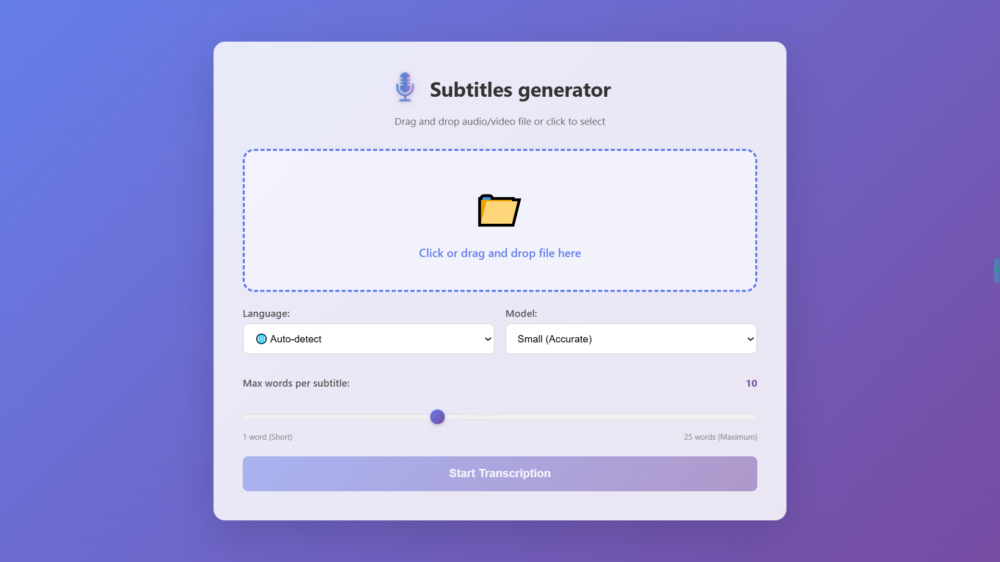
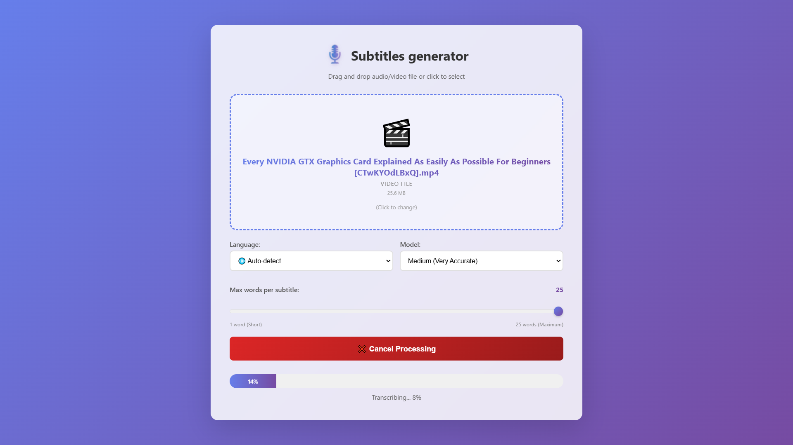
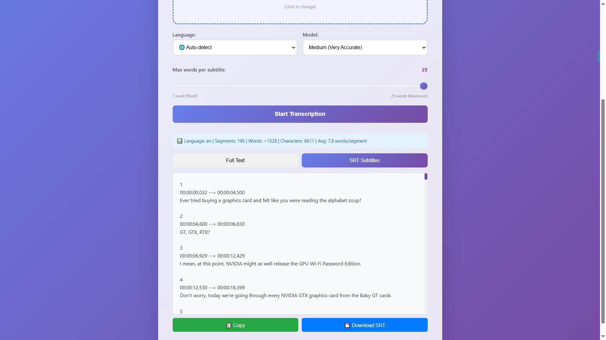

# 🎤 Whisper Transcription Web App speech-to-text

[](https://www.python.org/downloads/)
[](https://flask.palletsprojects.com/)
[](https://github.com/SYSTRAN/faster-whisper)
[](https://opensource.org/licenses/MIT)

> 🤖 **Attention:** This project was entirely written by Artificial Intelligence, including all code and the README. Created for demonstration purposes of modern AI capabilities.

A powerful web application for **automatically generating subtitles (.SRT)** and extracting text from audio/video files. Thanks to the use of Faster-Whisper (an optimized version of CTranslate2), the application runs four times faster than the original Whisper while consuming significantly fewer resources, and **supports over 100 languages!**



## ✨ Features

- 🎵 **Format Support:** WAV, MP3, MP4, AVI, MKV, FLAC, M4A, OGG, WebM
- 🌍 **Multilingual:** Supports 100+ languages
- 📝 **Subtitle Generation:** Automatic creation of .SRT files
- 🖱️ **Drag & Drop:** Convenient file uploading via drag and drop
- ⚡ **Progress Bar:** Real-time tracking of the transcription process
- ❌ **Task Cancellation:** The ability to instantly stop server processing with a single click, freeing up system resources.
- 🎯 **Model Selection:** From fast to the most accurate options

## 🧠 Faster-Whisper Models

| Model | Speed | Accuracy | Memory (RAM) | VRAM | Recommendations |
|--------|-----------|----------|---------------|------|--------------|
| `tiny` | ⚡⚡⚡⚡ | 🟡 Average | ~0.4 GB | - | For quick tests and short files |
| `base` | ⚡⚡⚡ | 🟢 Good | ~0.7 GB | - | **Optimal choice** for most cases |
| `small` | ⚡⚡ | 🟢 High | ~1.2 GB | - | If better accuracy is needed |
| `medium` | ⚡ | 🟢 Very High | ~2.1 GB | 1 GB | For professional transcription |
| `large-v2` | 🐢 | 🟢 Excellent | ~3.8 GB | 2 GB | High quality at moderate resource cost |
| `large-v3` | 🐢 | 🟢 Best | ~4.2 GB | 2.5 GB | Maximum quality |
| large-v3-turbo | ⚡⚡⚡ | 🟢 Very high | ~3.0 GB | 2 GB | The best balance of speed and quality |

### 💡 Choosing a Model Based on Your Resources:
- **4 GB RAM:** Use `tiny` or `base`
- **8 GB RAM:** You can use `small` or `medium`
- **16+ GB RAM:** All models are available, including `large-v3`
- **NVIDIA GPU:** Significantly speeds up all models (automatically used via CuBLAS)

> ⚠️ **Note:** Thanks to CTranslate2, `faster-whisper` uses **2–4× less RAM and VRAM** compared to the original Whisper at the same accuracy. The `base` or `small` model is recommended for most tasks.

## 📸 Work Examples

### Transcription Result

<p float="left">
  
  
</p>

## 🚀 Quick Start

> ⚠️ **Note:** If you need to force the CPU usage instead of using the automatic selection, go to app.py and change line 60 to:
```bash
models_cache[model_size] = WhisperModel(model_size, device="cpu", compute_type="int8")
```
### Requirements

- Python 3.11 (Mandatory, otherwise it will not work)
- FFmpeg (for video processing) must be installed and available in your system PATH
- 4+ GB RAM (depending on the model)

### Installing FFmpeg

**Windows:**
```bash
# Download from https://ffmpeg.org/download.html
# Or via Chocolatey:
choco install ffmpeg
```

**macOS:**
```bash
brew install ffmpeg
```

**Linux (Ubuntu/Debian):**
```bash
sudo apt-get update
sudo apt-get install ffmpeg
```
### Installing the Application

1. **Clone the repository and open the folder:**
```bash
git clone https://github.com/BlackPencil-69/Subtitles-and-text-whisper.git
```
```bash
cd Subtitles-and-text-whisper
```
2. **Create a virtual environment:**
```bash
py -3.11 -m venv venv
```
3. **Activate the virtual environment:**

**Windows:**
```bash
venv\Scripts\activate
```

**macOS/Linux:**
```bash
source venv/bin/activate
```
4. **Install dependencies:**
```bash
pip install -r requirements.txt
```
5. **Start the server:**
```bash
python app.py
```
6. **Open in browser:**
```
http://localhost:5000
```

### 📱 Access from a mobile device
To access from a phone on a local network:

open the link generated in the terminal.
Example: `Running on http://192.168.0.100:50000`

## 📖 How to use

1. **Upload file:** Drag and drop your audio/video file or click to select
2. **Select language:** Ukrainian, English, Japanese of other
3. **Select model:** From `tiny` (fast) to `large-v3-turbo` (most accurate)
4. **Click “Start transcription”**
5. **Wait for the result:** The progress bar will show the current status
6. **Copy the text** or **download .SRT subtitles**

## 🔧 Technologies
- **Backend:** Flask (Python)

- **AI Model:** faster-whisper

- **Media Processing:** FFmpeg

- **Frontend:** HTML5, CSS3, JavaScript (Vanilla)

- **UI/UX:** Responsive design, Drag & Drop API

## 🐛 Troubleshooting

### FFmpeg not found
```bash
# Check your installation:
ffmpeg -version

# If it doesn't work, reinstall or add it to your PATH
```

### Memory error (MemoryError)
- Use a smaller model (`tiny` or `base`)
- Close other programs
- Try a smaller file

### Slow transcription
- Use a smaller model
- Check if GPU is being used (if available)
- Reduce file size

### File not loading
- Check the file format (it must be on the list of supported formats)
- Check the size (maximum 500MB)
- Make sure the file is not corrupted


## 📝 License

This project is distributed under the MIT license. See the `LICENSE` file for details.

## 🙏 Acknowledgements

- [faster-whisper](https://github.com/SYSTRAN/faster-whisper) - for the excellent speech recognition model
- [Flask](https://flask.palletsprojects.com/) - for a simple and powerful web framework
- [FFmpeg](https://ffmpeg.org/) - for media file processing
- [Claude](https://claude.ai/) - for the core code
- [Gemini](https://gemini.google.com/) - for switching to Faster-Whisper
- [ChatGPT](https://chatgpt.com/) - for bug fixes

## 📧 Contact

GitHub: [@BlackPencil-69](https://github.com/BlackPencil-69/)

Telegram: [@MrKap1toshka](https://t.me/MrKap1toshka)

Discord: [@anonym_pro](https://discord.com/users/1149264703470698529)

Project Link: [https://github.com/BlackPencil-69/Subtitles-and-text-whisper](https://github.com/BlackPencil-69/Subtitles-and-text-whisper)

---

**⭐ If this project was helpful, please give it a star!**

> 🤖 This project was created using artificial intelligence to demonstrate the capabilities of AI in software development.

<p align="right">(<a href="#readme-top">back to top</a>)</p>


